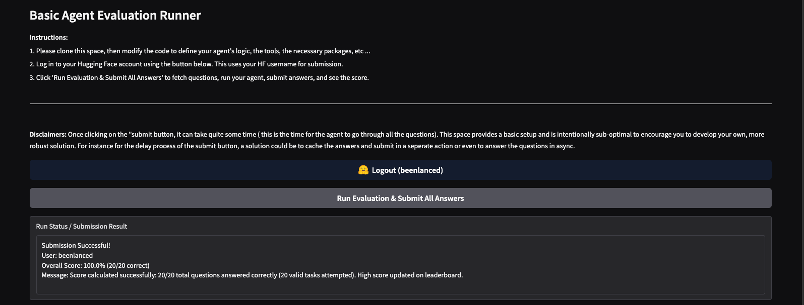

# Hugging Face Agents Course (Units 1-4)

<p>
  
</p>

[img source: Hugging Face](https://huggingface.co/datasets/agents-course/course-images/resolve/main/en/unit0/time-to-onboard.jpg)

## Project Description

This repo represents the collection of notebooks and related code needed to complete the four unit [Hugging Face Agent Course](https://huggingface.co/datasets/agents-course/course-images/resolve/main/en/unit0/time-to-onboard.jpg). The course is designed to evaluate the participant's ability to build and deploy an AI agent capable of answering complex, real-world questions. The course culminates in a final project: the creation of an AI Agent that utilizes multiple tools to answer real-world questions. The agent's performance is benchmarked against a subset of the [GAIA (General AI Assistant)](https://huggingface.co/papers/2311.12983) benchmark, with a target score of 30% or higher for course completion.

### Units 0 - 3

Units 0-3 introduce the concepts of Large Language Models (LLMs), agents, the three Agentic Frameworks implemented in the course:

- `Smolagents`
- `LlamaIndex`
- `LangGraph`, and

`Agentic Retrieval Augmented Generation (RAG)`. Phew! Yeah, this course has it all.

For these units, I constructed multiple Python coded Jupyter notebooks to build and test various agents and agentic RAG use cases using each of the three previously mentioned agentic frameworks.

### My Final Project - Unit 4

The GAIA benchmark, introduced in the paper _"GAIA: A Benchmark for General AI Assistants,"_ features 466 challenging questions that require multi-step reasoning, multimodal understanding, web browsing, and proficient tool use. These questions are conceptually simple for humans, but prove difficult for current AI systems, highlighting the limitations of standalone LLMs and emphasizing the need for agent-based systems.

The project involves interacting with a provided API to fetch questions and submit answers for scoring. The API exposes several routes, including `/questions` to retrieve the full list of evaluation questions, `/random-question` for a single question, `/files/{task_id}` to download associated files, and `/submit` to submit agent answers and update the leaderboard. The submission process requires a `Hugging Face username`, a link to the agent's code, and a list of answers for each `task_id`.

Hugging Face provides a codebase that served as a basic template, which participants are encouraged to modify and enhance to develop a more robust and effective agent. The evaluation is based on an exact match comparison of the submitted answers to the ground truth.

You are free to use whichever tools and Agentic framework that you would like.

Specifially, my final project builds an AI Agent using the Langgraph Agentic Framework, an Ollama LLM: `qwen3` that I run locally. Albeit it slow, running locally helped me to avoid exhausting credits on platforms like Google Gemini, OpenAI, and HuggingFace keeping the expenses for the course at extremely low -- $0.00 USD. Additionally, I added an Agentic RAG component to the project using a vector database to store contextual documents.

#### The Final Project's Key Components:

- **User Interface (Gradio):** This is the primary interface for users to interact with the agent. It allows users to initiate the evaluation process, view the status of the agent, and see the results of the questions and answers.

- **BasicAgent (Python application):** This component acts as the main application orchestrator. It handles user authentication (Hugging Face login), fetches questions from the external API, instantiates and runs the LangGraph Agent, and submits the agent's answers back to the external API for scoring.

- **Embeddings model:** The **sentence-transformers/all-mpnet-base-v2** from `HuggingFaceEmbeddings`.

- **Reasoning Component LLM:** The `qwen3` model from `Ollama`.

- **LangGraph Agent (core logic):** This is the brain of the system, responsible for processing questions and generating answers. It leverages the LangGraph framework to define a state machine that orchestrates the use of various tools and the Supabase Vector Store to answer complex queries.

- **External API (questions and submission):** This API, provided by the Hugging Face Agent Course, serves as the source of evaluation questions and the endpoint for submitting answers. It is crucial for the benchmarking process.

- **Tools:** The LangGraph Agent utilizes a suite of tools to gather information and perform calculations. These include:

  - **Wikipedia Search:** For retrieving information from Wikipedia.
  - **Web Search (Tavily):** For general web searches to find relevant information.
  - **Arxiv Search:** For searching academic papers on Arxiv.
  - **Calculator Tools:** For performing arithmetic operations (multiply, add, subtract, divide, modulus, square).
  - **Weather Tool:** For getting real-time weather updates for a given city.
  - **Current Time:** To get the current time in H:MM AM/PM format.

- **Supabase Vector Store (question retrieval):** This component acts as a knowledge base, storing embeddings of previously encountered questions or relevant documents. The agent can query this vector store to find similar questions or retrieve contextual information, aiding in answering new questions. Essentially, adding an agentic RAG component to the final project.

### My final Projects Score After Numerous Attempts and Code Tweaks

<p>
  
</p>

---

## Objective

The project contains the key elements:

- `ChatOllama` instantiates chatbot like feature for my LLM,
- `Embedding Model` using the sentence-transformers/all-mpnet-base-v2 to embedd question answer text,
- `Git` (version control),
- `Gradio` Python web framework to deploy the app on a local web server,
- `Hugging Face` using LLM models stored here,
- `Jupyter` python coded notebooks,
- `LangChain` to simplify the creation of applications using chaining process with LLMs,
- `Langfuse` the open-source LLM engineering platform designed to help develop, monitor, evaluate, and debug AI applications,
- `Langgraph` the Agentic Framework to help create Agents,
- `LlamaIndex` the Agentic Framework to help create Agents,
- `Natural Language Processing (NLP)` to understand, interpret, and manipulate text,
- `OpenTelemetry` an open-source observability framework to collect, process, and export telemetry data (metrics, logs, and traces),
- `Prompt Engineering` to provide instructions for the LLM on how to retrieve information,
- `Python` the standard modules,
- `qwen3` the Ollama reasoning compoent LLM,
- `Retrieval Augmented Generation (RAG)` connect the LLM with external data sources,
- `smolagents` Agentic Framework to help create Agents, CodeAgents, and Tool-Calling specifically, and
- `uv` package management including use of `ruff` for linting and formatting.

---

## Tech Stack


---

## Getting Started

Here are some instructions to help you set up this project.

---

## Installation Steps

### Prerequisites

- The Python version used for this project is `Python 3.12`
- Hugging Face account (for submission to the leaderboard)
- Supabase project with a `documents` table and `match_documents` function (for the vector store)
  - Supabase Service Key
  - Supabase URL
- API keys for your chosen LLM provider like Google Gemini or Hugging Face Inference API
  - I used the free credits on Hugging Face for Units 0-3, then used Ollama downloaded LLM for the final project as you may exhaust your free credits on various platforms.
- Tavily API key (for web search)
- Langfuse Public and Secret key
- Open weather API key

**Note:** Ensure that `system_prompt.txt` is present in the same directory as `agent.py`, as it contains the system prompt for the agent.

#### Create a Hugging Face Account

- Login or Sign Up on [Hugging Face](https://huggingface.co/login)

- Create a Hugging Face Access token

  - go [here](https://huggingface.co/settings/tokens)
  - Select create new token

- If you use the `Hugging Face CLI` (say when running models locally), here are some tips for working with Access Tokens:

  1. Using a token saved by huggingface-cli login:
     To remove this token, you can simply use the huggingface-cli logout command.
     This command will delete all tokens stored locally on your machine by the CLI.
     If you want to remove a specific token, you can provide its name as an argument to the logout command.
  2. Using the HF_TOKEN environment variable:
     If you're logged in using the HF_TOKEN environment variable, the huggingface-cli logout command will not log you out.
     In this case, you need to unset the environment variable directly in your machine's configuration.
     For example, in a Bash shell, you would use the command unset HF_TOKEN.
     In summary:
     If you used huggingface-cli login, use huggingface-cli logout.
     If you used the HF_TOKEN environment variable, use the appropriate command for your shell to unset the variable (e.g., unset HF_TOKEN in Bash)

#### Create a Langfuse Account

Allows you to perform `Observability` (i.e., traceability) for monitoring and analysis of the Agent with the assistance of `SmolagentsInstrumentor` which uses the `OpenTelemetry`(https://opentelemetry.io/) standard for instrumenting agent runs. Helps with inspections and logging.

- Create a Langfuse project so that you can create two API tokens
  - go [here](https://us.cloud.langfuse.com)
  - Create a new project which will allow you to generate
    - LANGFUSE_PUBLIC_KEY
    - LANGFUSE_SECRET_KEY

#### Download Ollama

Obtain the Ollama Application to run the Ollama Server [here](https://github.com/ollama/ollama?tab=readme-ov-file).

**Note** After building the project or anytime later you can also uninstall Ollama, if you are like me, and want to declutter your computing device.
(see instructions for macOS [here](https://www.youtube.com/watch?v=GRsy_Kaeq84)).

Here is an [Ollama Cheatsheet](https://secretdatascientist.com/ollama-cheatsheet/) as well.

- To load the `qwen3` LLM from Ollama once the Ollama server is running

  - **Pull** the `qwen3` model

  ```bash
  ollama pull qwen3:latest
  ```

#### Setting up Supabase Vector Store Database

- Log In or Sign Up to [Supabase](https://supabase.com/dashboard/sign-in?returnTo=%2Forg)

- How to work with Supabase

  - https://js.langchain.com/docs/integrations/vectorstores/supabase

  - https://discuss.huggingface.co/t/how-to-upload-documents-to-the-supabasevectorstore/161245

### Get the code -- Clone the Repo

1. Clone the repo (or download it as a zip file):

   ```bash
   git clone https://github.com/beenlanced/ai_agent_hugging_face_course.git
   ```

2. Create a virtual environment named `.venv` using `uv` Python version 3.12:

   ```bash
   uv venv --python=3.12
   ```

3. Activate the virtual environment: `.venv`

   On macOS and Linux:

   ```bash
   source .venv/bin/activate #mac
   ```

   On Windows:

   ```bash
    # In cmd.exe
    venv\Scripts\activate.bat
   ```

4. Install packages using `pyproject.toml` or (see special notes section)

   ```bash
   uv pip install -r pyproject.toml
   ```

### Install the Jupyter Notebook(s)

1. **Run the Notebooks for each Unit**

   - Run the Jupyter Notebook(s) in the Jupyter UI or in VS Code.

### Running the Final Project

0. **Make sure the Ollama Server is running**

1. **Run app.py script**

   To run the application and evaluate your agent, execute the `app.py` file:

   ```bash
   python3 app.py
   ```

   This will launch a Gradio interface in your web browser (see url given after running the command above). Follow the instructions on the Gradio interface:

   1. **Log in to Hugging Face:** Use the provided button to log in with your Hugging Face account. Your username will be used for submission to the leaderboard.

   - **Running Locally and not in Hugging Face** If you are like me, and wanted to run your model locally, you will need to open a terminal before the `python3 app.py` step and run the following command:

   ```bash
   huggingface-cli login
   ```

   you will be prompted to insert your **HF_TOKEN**

   Log in via this command line will log you into Hugging face for the next steps and help avoide issues during your model evaluation.

   See instructions for using `huggingface-cli logout` earlier once you have completed model evaluation.

   2. **Run Evaluation & Submit All Answers:** Click this button to initiate the evaluation process. The application will:
      - Fetch questions from the external API.
      - Run your `BasicAgent` (which utilizes the `LangGraph Agent` and its tools) on each question.
      - Collect the answers.
      - Submit your answers to the Hugging Face scoring API.

   Results, including the submission status and a table of questions with your agent's submitted answers, will be displayed in the Gradio interface.

## Final Project Evaluation

The primary goal of this project is to achieve a score of 30% or higher on a subset of the GAIA benchmark. The evaluation process is handled by an external API provided by the Hugging Face Agent Course. Here's how it works:

- **Question Fetching:** The `app.py` script fetches a set of 20 questions, extracted from Level 1 of the GAIA validation set. These questions are chosen for their manageable complexity, requiring fewer than 5 steps and minimal tool usage.

- **Answer Submission:** Your agent's generated answers are submitted to the `/submit` endpoint of the external API. The submission payload includes your Hugging Face username, a link to your agent's code (for verification), and a list of `task_id` and `submitted_answer` pairs.

- **Scoring:** The API evaluates your submitted answers against ground truth answers using an **exact match** comparison. This means your agent's output must precisely match the expected answer to be considered correct. Therefore, careful prompting and precise answer formatting by your agent are crucial.

- **Leaderboard:** Upon successful submission, your score is updated on a public leaderboard hosted on Hugging Face. This allows you to track your progress and compare your agent's performance with other participants.

**Important Considerations for Evaluation:**

- **Exact Match:** Pay close attention to the format and content of the expected answers. Even minor discrepancies (e.g., extra spaces, incorrect capitalization, or additional text) can lead to an incorrect score.
- **Agent Code Link:** Ensure your Hugging Face Space containing your agent's code is public so that the submission can be verified.
- **Error Handling:** The `app.py` includes robust error handling for API requests and agent execution. Any errors during question fetching, agent execution, or submission will be reported in the Gradio interface.

---

## References

[1] GAIA: A Benchmark for General AI Assistants: [https://arxiv.org/abs/2311.12983](https://arxiv.org/abs/2311.12983)

[2] Gradio Documentation: [https://gradio.app/docs/](https://gradio.app/docs/)

[3] Hugging Face Agent Course: [https://huggingface.co/learn/deep-rl-course/unit4/introduction](https://huggingface.co/learn/deep-rl-course/unit4/introduction)

[4] LangChain Documentation: [https://python.langchain.com/docs/get_started/introduction](https://python.langchain.com/docs/get_started/introduction)

[5] LangGraph Documentation: [https://langchain-ai.github.io/langgraph/](https://langchain-ai.github.io/langgraph/)

[6] Supabase Documentation: [https://supabase.com/docs](https://supabase.com/docs)

[8] Tavily API: [https://tavily.com/](https://tavily.com/)

---

### Final Words

Thanks for visiting.

Give the project a star (⭐) if you liked it or if it was helpful to you!

You've `beenlanced`! 😉

---

## Acknowledgements

I would like to extend my gratitude to all the individuals and organizations who helped in the development and success of this project. Your support, whether through contributions, inspiration, or encouragement, have been invaluable. Thank you.

Specifically, I would like to acknowledge:

- THe folks at [Hugging Face (HF)](https://huggingface.co/learn/agents-course/unit2/introduction) for putting the course together. It exposes you to numerous frameworks and the final project hightlights the complexity of answering questions that AI agents have to go address. Kudos HF team! I learned a lot.

- [Hema Kalyan Murapaka](https://www.linkedin.com/in/hemakalyan) and [Benito Martin](https://martindatasol.com/blog) for sharing their README.md templates upon which I have derived my README.md.

- The folks at Astral for their UV [documentation](https://docs.astral.sh/uv/)

---

## License

This project is licensed under the MIT License - see the [LICENSE](./LICENSE) file for details
